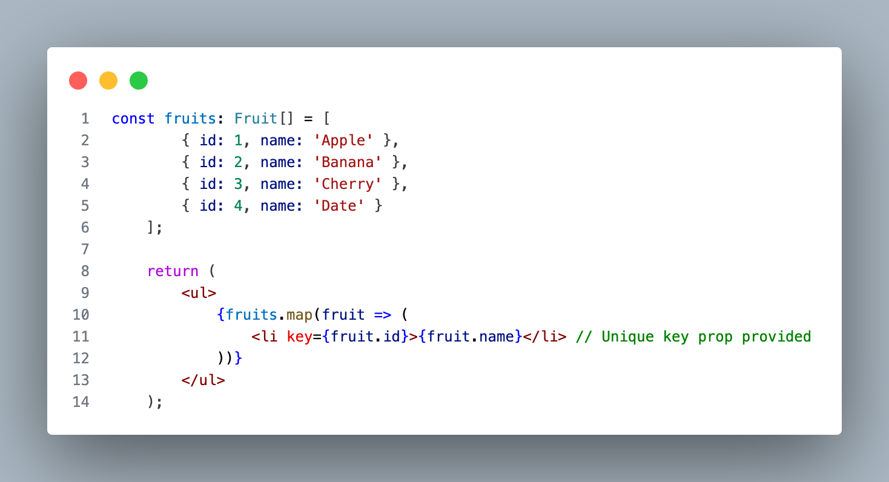

# Code Quality

Code quality in React, TypeScript, and JavaScript is essential to ensure maintainable, scalable, and efficient applications. Key requirements include writing clean, readable, and well-structured code by following established patterns like component modularization in React. TypeScript adds an extra layer by enforcing type safety, reducing runtime errors and improving overall reliability. Consistent formatting with tools like Prettier or ESLint helps maintain uniformity across the codebase. Best practices also involve avoiding unnecessary re-renders, optimizing performance with techniques like memoization, and ensuring proper test coverage to catch bugs early. Altogether, these practices contribute to better collaboration, fewer errors, and a more robust application.

## Table of Contents

- [Code Quality](#code-quality)
  - [Table of Contents](#table-of-contents)
  - [Javascript](#javascript)
    - [ESLint and Prettier](#eslint-and-prettier)
    - [Linter Errors](#linter-errors)
    - [PR Descriptions and Git Commits](#pr-descriptions-and-git-commits)
    - [Remove Console.logs](#remove-consolelogs)
    - [Modules and Imports](#modules-and-imports)
    - [Unit Tests and Code Coverage](#unit-tests-and-code-coverage)
    - [Null and Undefined](#null-and-undefined)
    - [Use Async/Await vs. Promises](#use-asyncawait-vs-promises)
    - [Hardcoded values/tokens/keys](#hardcoded-valuestokenskeys)
  - [Node.JS](#nodejs)
    - [HTTP Status Codes](#http-status-codes)
    - [Fastify and Decorator Pattern](#fastify-and-decorator-pattern)
    - [API Design](#api-design)
    - [Repository Pattern](#repository-pattern)
  - [Typescript](#typescript)
    - [Avoiding `any` Type](#avoiding-any-type)
    - [Type Annotation](#type-annotation)
    - [Consider using generic functions and classes](#consider-using-generic-functions-and-classes)
  - [React](#react)
    - [Keep Components Small](#keep-components-small)
    - [Component Comments](#component-comments)
    - [Responsive Views](#responsive-views)
    - [Accessibility coverage](#accessibility-coverage)
    - [Accessibility Tools using Lighthouse](#accessibility-tools-using-lighthouse)
    - [Remove unused NPM packages](#remove-unused-npm-packages)
    - [3rd party package usage](#3rd-party-package-usage)
    - [Unique Property Keys](#unique-property-keys)
    - [Unused Properties](#unused-properties)
    - [Naming Conventions](#naming-conventions)
    - [Enumerate Similar Values](#enumerate-similar-values)
    - [Create Service for API calls](#create-service-for-api-calls)
    - [Handle API errors](#handle-api-errors)
    - [Use Destructured Assignments for arrays and objects](#use-destructured-assignments-for-arrays-and-objects)
    - [Create Custom Hooks](#create-custom-hooks)
    - [Use useCallback and useEffect with the proper dependencies](#use-usecallback-and-useeffect-with-the-proper-dependencies)
    - [Use useMemo to recalculate a derived value from a state change](#use-usememo-to-recalculate-a-derived-value-from-a-state-change)
    - [Avoid infinite API Calls or infinite state changes inside loops](#avoid-infinite-api-calls-or-infinite-state-changes-inside-loops)
    - [Don't use dangerouslySetInnerHtml](#dont-use-dangerouslysetinnerhtml)
    - [Unregister and clean up timers](#unregister-and-clean-up-timers)
  - [Coding Principals](#coding-principals)
    - [DRY (Do Not Repeat Yourself)](#dry-do-not-repeat-yourself)
    - [S.O.L.I.D code principles](#solid-code-principles)

## Javascript

### ESLint and Prettier

Using ESLint and Prettier in React is crucial for maintaining consistent code quality and formatting throughout the project. ESLint helps catch common errors and enforces coding standards, while Prettier automatically formats the code for readability. Together, they improve collaboration among developers, reduce bugs, and ensure a clean, maintainable codebase.
  
### Linter Errors

Addressing linter errors in React helps maintain consistent code quality, catch potential bugs early, and enforce best practices, ensuring the codebase remains clean, efficient, and easy to maintain.

❌ Incorrect Usage:

### PR Descriptions and Git Commits

When commenting on Git commits and writing PR descriptions, be clear and concise, focusing on what changes were made and why. Provide enough context to help others understand the impact of the changes, making it easier for future reviews and debugging.

### Remove Console.logs

Removing console.log statements from React code is important for maintaining a clean production environment, as they can expose sensitive information and negatively impact performance if left in the final build.

❌ Incorrect Usage:

### Modules and Imports

Use ES6 module syntax (import and export) for importing and exporting modules.
Organize imports by grouping them by module and separating them with a newline for clarity.

### Unit Tests and Code Coverage

Unit testing React components with Jest and React Testing Library ensures that individual parts of an application function as expected. Jest provides a powerful framework for running tests, while React Testing Library helps simulate user interactions and check component behavior. Tests should focus on verifying component outputs based on different prop inputs, events, and state changes, ensuring functionality is correct. To achieve 85% code coverage, it's important to write tests for edge cases and cover critical paths like rendering, event handling, and conditional rendering. Tools like Jest's built-in code coverage reports can help track progress and highlight untested code, allowing developers to meet the desired coverage goal efficiently.

### Null and Undefined

Prefer undefined over null for optional properties. Use optional chaining (?.) and nullish coalescing (??) to handle undefined values
safely.

✅ Correct Usage:

### Use Async/Await vs. Promises

Avoid using .then() and .catch() for promise handling unless there is no other alternative. This helps in maintaining a consistent and modern approach to asynchronous programming. Using async/await in React simplifies asynchronous code by making it more readable and easier to follow compared to traditional promises. It allows you to write code that looks synchronous while still handling asynchronous tasks. To handle rejections, wrap await calls in try/catch blocks, ensuring that any errors are properly caught and managed, leading to more predictable and maintainable error handling.

✅ Correct Usage:

### Hardcoded values/tokens/keys

Avoid using hard-coded tokens or values in React components, as they can pose security risks and make the code harder to maintain. Instead, use environment variables (env constants) to securely manage configuration values, ensuring flexibility and better security practices.

✅ Correct Usage:

## Node.JS

### HTTP Status Codes

  Specific Status Codes: Use specific and descriptive HTTP status codes rather than generic 300, 400, or 500 series codes. For example, use 404 for “Not Found” or 401 for “Unauthorized” instead of a generic 400. This helps frontend developers understand the exact issue and respond accordingly. Only use the broader series codes if there is no other option.

### Fastify and Decorator Pattern

  - Use Fastify: Utilize Fastify as the Node.js framework for building backend services.
  
  - Decorator Pattern: Implement the Decorator pattern with Fastify to extend the
  functionality of routes and plugins. This pattern allows for adding new behaviors to existing code in a flexible and reusable manner.

  ✅ Correct Usage:
  

### API Design

  - `Query` Strings and `POST` Requests for Simple Requests: Optionally use query strings or `POST` requests for API data pulls when there are five or fewer parameters.
  - `POST` Requests for Complex Queries: Use `POST` requests for API data pulls when there are more than five parameters. This approach helps handle more complex queries efficiently and keeps the request structure organized.
  - Use of `PUT` for Idempotency: Prefer using the `PUT` method over PATCH for updates to ensure idempotency. `PUT` requests should be used when the full resource is being updated, and the operation can be repeated without changing the result.

### Repository Pattern

Use of Repository Pattern: Implement the Repository pattern to organize data access logic. This pattern provides a clean separation between the data access and business logic layers, promoting maintainability and testability.

## Typescript

### Avoiding `any` Type

No `any` Types: Avoid using the any type as it defeats the purpose of TypeScript’s
type safety. Use specific types or unknown when the type is not known.

❌ Incorrect Usage:

### Type Annotation

In React with TypeScript, both `interface` and `type` can be used to define the shape of props, state, or other object structures, but each has its own best use cases.

- Use `interfaces` when you want to describe the structure of an object and when that structure might be extended or merged, as interfaces support declaration merging and inheritance. This makes them ideal for use cases like defining component props that might need to be extended in the future.

- On the other hand, use `types` when you need more flexibility, such as defining union types, intersection types, or complex combinations of other types. Types are more suited for situations where you need to work with a variety of types or when the structure won't need extension or merging.

- In general, if you're strictly working with object shapes and expect them to be extended, prefer `interfaces`. If you're working with more complex types, or need unions and intersections, prefer `types`.

✅ Correct Usage:

### Consider using generic functions and classes

Using generic functions and classes in React is important for creating reusable and flexible components that can work with various data types, enhancing code scalability. Generics allow you to define components and utilities that adapt to different types while maintaining type safety, which leads to cleaner, more robust, and maintainable code in TypeScript-based React applications.

✅ Correct Usage:
    Let's start by creating a generic class that holds a list of items.
    
    Next, let's define a generic function that takes an ItemList and logs its items to the console.
    
    Now, let's create a React component that uses these generic functions and classes.
    
    To use this component, you can pass in any type of item:
    

## React

### Keep Components Small

If the size of the component exceeds 200-300 lines, then try to create child components. Also try and keep JSX markup should be no more than 50 lines.

✅ Correct Usage:

### Component Comments

When commenting React components and props, focus on explaining the component's purpose and the role of each prop, especially if their usage or data type isn't immediately clear. Keep comments concise and relevant to aid future developers in understanding the logic without cluttering the code.

✅ Correct Usage:

### Responsive Views

Ensure React components are responsive down to an iPad screen size, utilize CSS media queries or responsive frameworks like Flexbox and Grid, adjusting layouts and element sizes accordingly. This approach allows components to adapt gracefully to different screen sizes, ensuring a smooth user experience across devices.

### Accessibility coverage

To improve accessibility in React components, use semantic HTML elements, manage keyboard focus, and ensure proper ARIA roles for interactive components. Additionally, include descriptive alt text for images so that screen readers can convey the image's purpose to visually impaired users, providing a complete and inclusive experience for all.

✅ Correct Usage:

### Accessibility Tools using Lighthouse

Testing React components for accessibility using Lighthouse helps ensure that applications are usable by all users, including those with disabilities. Lighthouse provides automated audits that check for common accessibility issues, like proper use of semantic HTML, alt text for images, and keyboard navigation support. Regularly running these audits ensures that components meet accessibility standards and improve overall user experience.

### Remove unused NPM packages

Removing unused NPM packages from a React component helps reduce the bundle size and improve performance. Regularly auditing dependencies and removing unnecessary packages keeps the project lean, lowers security risks, and simplifies future maintenance.

### 3rd party package usage

When using third-party NPM packages in React, it's important to evaluate their impact on performance and bundle size. Opt for lightweight alternatives when available, as this can reduce load times and enhance overall application performance without sacrificing functionality.

### Unique Property Keys

In React, JSX property keys are essential for uniquely identifying elements when rendering lists of components. They help React efficiently update and re-render components by tracking changes, additions, or removals, preventing unnecessary re-renders and improving performance. Keys should be unique and stable, ideally using unique IDs or array indexes as a last resort.

❌ Incorrect Usage:

✅ Correct Usage:

### Unused Properties

Unused properties in React components can lead to unnecessary complexity and potential performance issues, so it's important to remove them
  
❌ Incorrect Usage:

### Naming Conventions

In React, naming conventions are important for readability and maintainability. Component names should be written in PascalCase, while props and functions typically follow camelCase. Clear, descriptive names help make the codebase more understandable and easier to navigate for developers.

✅ Correct Usage:

### Enumerate Similar Values

In React, using enum to enumerate similar values provides a structured and readable way to define a set of constant values, ensuring type safety and reducing the risk of errors when accessing or using those values throughout the component

✅ Correct Usage:

### Create Service for API calls

When calling APIs in React, it's a good practice to create a dedicated service or utility to handle API requests. This approach separates the API logic from components, promotes code reuse, simplifies testing, and keeps components clean and focused on rendering UI.

✅ Correct Usage:

### Handle API errors

Handling API errors in React should involve catching errors in promises and providing user-friendly feedback, such as error messages or fallback content, while logging the errors for debugging and ensuring the application remains stable.

✅ Correct Usage:

### Use Destructured Assignments for arrays and objects

Destructuring arrays and objects in React allows for cleaner and more concise code by directly extracting values or properties from complex data structures. This simplifies the handling of props, state, and API responses, making it easier to work with nested data and improving readability within components.

✅ Correct Usage:

### Create Custom Hooks

Writing custom hooks in React is useful when you want to extract and reuse logic that is shared across multiple components, such as handling form inputs or managing API requests. Custom hooks help keep your components clean and focused on rendering, while promoting code reusability and separation of concerns, improving maintainability.

✅ Correct Usage:

### Use useCallback and useEffect with the proper dependencies

In React, useCallback is used to memoize functions, preventing unnecessary re-creation of functions between renders, which is useful when passing callbacks to child components. The dependencies array ensures the function is only recreated when specific values change. Similarly, useEffect runs side effects like data fetching or subscriptions, and the dependencies array controls when the effect should re-run, ensuring it's only triggered when its dependencies change, optimizing performance and avoiding infinite loops.

✅ Correct Usage:

### Use useMemo to recalculate a derived value from a state change

In React, useMemo is used to efficiently calculate derived properties based on state changes by memoizing the result, ensuring the computation only runs when its dependencies change. This is often preferable to useEffect for such calculations, as it avoids unnecessary side effects and re-renders, providing better performance for computationally expensive operations.

✅ Correct Usage:

### Avoid infinite API Calls or infinite state changes inside loops

To avoid infinite API calls or infinite state changes when using useEffect, ensure that the dependencies array is correctly specified, only including the necessary variables. Additionally, avoid directly updating state within the effect without proper conditions, as this can trigger continuous re-renders and lead to a loop of API calls or state changes.

❌ Incorrect Usage:

### Don't use dangerouslySetInnerHtml

Using dangerouslySetInnerHTML in React should be avoided because it can expose your application to security vulnerabilities like cross-site scripting (XSS) attacks. Instead, opt for safer alternatives, such as using React's built-in rendering methods or sanitizing any input that requires dynamic HTML rendering.

❌ Incorrect Usage:

### Unregister and clean up timers

In React, it’s important to unregister and clean up timers like setInterval and setTimeout within a component’s useEffect cleanup function to prevent memory leaks and unwanted behavior. This ensures that timers stop running when the component is unmounted or when dependencies change

✅ Correct Usage:

## Coding Principals

### DRY (Do Not Repeat Yourself)

The DRY (Don't Repeat Yourself) principle in React encourages reusing components and logic to avoid duplication in the codebase. By creating modular, reusable components and hooks, developers can maintain cleaner, more efficient code that is easier to update and scale.
  
### S.O.L.I.D code principles

  - #### S. Single Responsibility Principle

    The Single Responsibility Principle states that a class (or component, in the case of React) should have only one reason to change, meaning it should have one responsibility.
    - AddTodo Component: Handles the responsibility of adding a new to-do item. It takes the onAdd function as a prop and invokes it when a new item is added.
    - TodoItem Component: Responsible for rendering a single to-do item and providing the option to remove it.
    - TodoList Component: Manages the state of the to-do list, including adding and removing items, and ties the other components together.
    - This simplified version maintains the Single Responsibility Principle by keeping each part of the application focused on a single task, all within a single file for easier comprehension and management.
    
  
  - #### O. Open-Closed Principle

    The Open-Closed Principle (OCP) states that a component or module should be open for extension but closed for modification. This means that you should be able to add new functionality without changing the existing code.
    - TodoItem Component: The TodoItem component is designed to display different types of to-do items. It is open for extension by allowing new types of to-do items (e.g., "priority") to be added without modifying the component itself. The getStyle function is used to apply different styles based on the type of the to-do item.
    - AddTodo Component: The AddTodo component allows users to specify the type of to-do they want to add (regular or priority). This can be easily extended to add more types without changing the existing code structure.
    - TodoList Component: The TodoList component manages the list of to-dos and their types. The addTodo function can handle any type of to-do, making it open to adding new types without needing modifications.
    - By following the Open-Closed Principle, this example is designed so that you can easily extend the functionality (like adding new types of to-dos) without altering the existing codebase.
    

  - #### L. Liskov Substitution Principle

    The Liskov Substitution Principle (LSP) states that objects of a superclass should be replaceable with objects of a subclass without affecting the correctness of the program. In other words, derived classes should be substitutable for their base classes.
    - Notification Class (Base Class): This class serves as the base class for different types of notifications. It has a display method that returns a string representation of the notification.
    - EmailNotification and SMSNotification Classes (Derived Classes): These classes extend the Notification class. They override the display method to provide specific behavior for email and SMS notifications. They still adhere to the contract of the base class, meaning they can be substituted for the base class without any issues.
    - NotificationDisplay Component: This React component takes a Notification object as a prop and uses its display method to render the appropriate message. It doesn't need to know whether the notification is a basic notification, an email, or an SMS.
    - App Component: The main component creates a list of different types of notifications (Notification, EmailNotification, SMSNotification) and renders them using the NotificationDisplay component.
    

  - #### I. Interface Segregation Principle

      The Interface Segregation Principle (ISP) states that no client should be forced to depend on methods it does not use. In simpler terms, it's better to have multiple, smaller, and more specific interfaces than a large, general-purpose one.
      - Viewable Interface: This interface is used for users who have the ability to view content. Both Admin and Guest classes implement this interface because they both can view content.
      - Manageable Interface: This interface is used for users who have the ability to manage other users. Only the Admin class implements this interface because only admins have user management capabilities.
      - Admin Class: This class implements both Viewable and Manageable interfaces since an admin can both view content and manage users.
      - Guest Class: This class implements only the Viewable interface since a guest can only view content and has no management capabilities.
      - ContentViewer Component: This component takes a Viewable user and allows them to view content. Both Admin and Guest can use this component.
      - UserManager Component: This component takes a Manageable user and allows them to manage users. Only Admin can use this component because only Admin implements the Manageable interface.
      - UserManagementSystem Component: This is the main component that demonstrates the ISP in action. It creates an admin and a guest, then renders the appropriate components for each role based on their capabilities.
      

  - #### D. Dependency Inversion Principle

      The Dependency Inversion Principle (DIP) states that high-level modules should not depend on low-level modules. Both should depend on abstractions. Additionally, abstractions should not depend on details; details should depend on abstractions.
      - IDataService Interface: This is the abstraction that defines the contract for any data service. It declares the fetchData method, which returns a promise of a list of strings. This interface does not depend on any details of how the data is fetched.
      - ApiDataService Class: This is a concrete implementation of the IDataService interface. It simulates fetching data from an API by returning a promise that resolves after a timeout.
      - LocalStorageDataService Class: Another concrete implementation of IDataService, simulating data retrieval from local storage. This class can easily replace ApiDataService without modifying the high-level component.
      - DataDisplay Component: This high-level component depends on the IDataService interface rather than a specific implementation. It uses the service passed as a prop to fetch and display data. This decouples the component from the actual data-fetching logic, adhering to the Dependency Inversion Principle.
      - App Component: The main component where the specific implementation of IDataService is chosen. You can easily swap ApiDataService with LocalStorageDataService (or any other implementation) without modifying the DataDisplay component.
      
